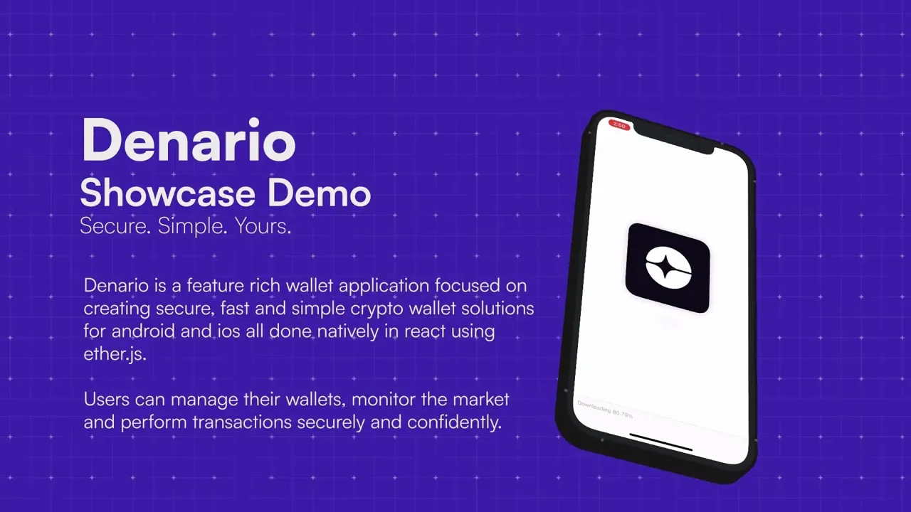

<!-- <p align="center">
  
</p> -->
# Denario

Secure. Simple. Yours.

---

## 1. Overview/Introduction:

We are Denario, a feature rich wallet application focused on creating secure, fast and simple crypto wallet solutions for android and ios all done natively in react using ether.js. Currently deployed on Sepolia Eth Testnet. Features include creating, importing wallets, showing token balances in real time, swapping/wrapping tokens, for security purposes user can access all login logs, transaction hashes, receiver addresses in one click, you can send, receive, scan, compare and biometrically verify. 

— Currently deployed on Sepolia Eth Testnet, our platform offers features including creating, importing wallets, showing token balances in real time, swapping/wrapping tokens, send and receive tokens, scan wallet QR, get all relevant token market data and more. We use a combination of locally encrypted secure storage, biometric authentication and Firebase-backed server protection to safeguard sensitive data with additional precautions against scam/phishing as well. Users can manage their wallets, monitor the market and perform transactions securely and confidently.

---

## Demo Video (click on the image)


[](https://vimeo.com/1100429386)


---

## 2. Tech Stack

- **Frontend:** React native (with Expo)  
  Used to create the native Android and iOS app’s UI with Expo for simplified testing.

- **Blockchain Library:** Ether.js  
  Ethereum JS library to interact with the Ethereum blockchain with RPC’s and creating wallet and executing transactions securely.  
  https://docs.ethers.org/

- **Backend:** Node.js (Express server)

- **Test Network:** Ethereum Sepolia Testnet  
  Used for testing real blockchain logic and interactions without risking real assets.  
  https://sepolia.dev/

- **API:**  
  [CoinGecko](https://www.coingecko.com/en/api),  
  [Cryptocompare](https://min-api.cryptocompare.com/),  
  [Firebase](https://firebase.google.com/docs)  
  CoinGecko and CryptoCompare provide all the relevant up to date market data and news articles, and Firebase for user activity and data storage with encryption.

---

## 3. Features

- Create a new wallet with randomly generated mnemonic phrases.
- Restore existing wallets using mnemonics or private keys.
- Show token balances in real time
- Wrap tokens
- View login logs and detailed transaction history.
- Built for the Sepolia ETH Testnet (safe for development and testing).

---

## 4. How to run:

```bash
git clone https://github.com/sol4nki/denario.git
cd denario
npm install
npx expo start
```

### To test:

- Use Expo Go app on your device
- Scan the QR code displayed in terminal

---

## 5. Wallet Setup

- **Create New Wallet** : Generate a new Ethereum wallet directly in-app which generates a wallet address with its mnemonic phrase.
- **Login Wallet**: Login into your wallet using mnemonic phrase or private key.

**Private key and wallet address are encrypted and stored securely on the device using local storage mechanism ([expo-secure-storage](https://docs.expo.dev/versions/latest/sdk/securestore/)), guaranteeing that sensitive data never leaves your device or gets synced to cloud without your knowledge.**

---

## 6. Code Overview

### Navigation Structure

- Stack Navigation is used for authentication and onboarding flows.
- Tab Navigation is used for the main app, with four primary tabs:
    - Home
    - Swap
    - Activity
    - More

### Screens & Components

#### Welcome Flow

- Welcome.js / Welcome1.js / Welcome2.js / Welcome3.js
    - Animated onboarding screens introducing the app's features.
    - Users can swipe or tap through to learn about security, ease of use, and control.
    - Final screen offers "Get Started" or "Login" options.

#### Authentication Flow

- SignupScreen.js
    - Entry point for new users.
    - Options: Create New Wallet or "I already have a wallet" (login).
    - Branding and terms of service notice.
- PasswordScreen.js
    - Users set and confirm a password for wallet access.
    - Must agree to Terms of Service (modal with hackathon disclaimer and legal terms).
- RecoveryPhraseScreen.js
    - Generates a new wallet and displays the 12-word recovery phrase.
    - User must confirm they have saved the phrase before proceeding.
    - Wallet address is shown and can be copied.
    - Security Note: The recovery phrase is the only way to recover the wallet.
- LoginScreen.js
    - For returning users.
    - Enter 12-word recovery phrase to restore wallet.
    - Securely stores wallet address and private key on device.
    - Option to paste from clipboard.
    - Navigates to main app on success.

- SuccessScreen.js
    - Confirmation after successful wallet creation or import.
    - Encourages user to continue to the main app.


#### Main App Tabs

- TabNavigator.js
    - Four main tabs: Home, Swap, Activity, More.
    - Custom icons and styles.  

#### Core Tabs and Screens

- Homepage.js
    - Displays total wallet balance in ETH.
    - Action buttons: Buy, Receive, Send, Activity.
    - List of tokens/assets with balances, price, and change.
    - Pull-to-refresh for latest balances and token data.
- TradeSwap.js
    - Allows users to swap between supported tokens (ETH, WETH, USDC, DAI, LINK) on the Sepolia testnet.
    - Fetches wallet and token balances.
    - Handles token selection, amount input, and swap execution.
    - Logs swap transactions to Firestore.
    - Displays transaction status and errors.
- RecentLogs.js
    - Shows login history and transaction history for the wallet.
    - Fetches data from Firestore.
    - Each log/transaction can be tapped for details.
    - Pull-to-refresh for latest activity.

- More.js
    - Profile, Settings, Security & Privacy, Notifications, Support, Website, Terms of Service, Privacy Policy, About.
    - Fetches and displays latest crypto news (via NewsCard).
    - Modal popups for profile and settings.
    - Links to external resources.

#### Core Features

- Buy.js
    - Allows users to buy tokens (simulated, as this is a demo).
    - Select token, enter amount, and execute transaction.
    - Handles transaction status, errors, and balance updates.
- Send.js
    - Send tokens to another address.
    - Select token, enter recipient and amount.
    - Validates input, checks for scam addresses, and executes transaction.
    - Logs transaction to Firestore.
- Receive.js
    - Displays wallet address and QR code for receiving tokens.
    - Allows user to copy or share their address.
    - Token selector for different assets.
- QRscanner.js
    - Scans QR codes to quickly input recipient addresses for sending tokens.
    - Requests camera permissions as needed.
- CoinDetails.js
    - Detailed view for a specific token/coin.
    - Shows price, market cap, rank, and a price chart.
    - Fetches data from external APIs.
- Search.js
    - Search for trending tokens and view details.
    - Recent tokens and trending tokens are displayed.
    - Navigates to CoinDetails on selection.
- SearchActivity.js
    - Search and filter through all login and transaction history.
    - Copy details to clipboard.
    - Modal for detailed view of each log/transaction.
- Biometric.js
    - Biometric authentication (fingerprint/face) for added security.
    - Fallback to camera/photo if biometrics unavailable.

---


## 7. Walkthrough

### 1. Welcome Page
- Using [expo-device](https://docs.expo.dev/versions/latest/sdk/device/) we first check if the user’s device is jailbroken/rooted or not if the app is jailbroken the user gets an alert to proceed with caution.

    ```jsx
    useEffect(() => {
        if (Device.isDevice && Device.isRootedExperimentalAsync) {
        Alert.alert(
            "Security Warning",
            "Your device appears to be rooted or jailbroken. For your security, some features may be disabled."
        );
    }},[]);
    ```

### 2. Login / Wallet Setup
- The login screen allows the user to access their crypto wallet using their 12 word recovery phrase. The app uses [Ethers.js](https://docs.ethers.org/) To derive the wallet from the phrase. It securely stores the private key on the device and logs the other necessary stuff like address, IP/Geo-location, device ID using [firebase’s firestore](https://firebase.google.com/docs/firestore) and takes the user to the main app


    ```jsx
    const phrase = recoveryWords.join(' ').trim();

    // creating wallet from recovery phrase
    const wallet = ethers.Wallet.fromPhrase(phrase);
    const address = wallet.address;
    const privateKey = wallet.privateKey;

    ```

    ```jsx
    const wallet = await generateWalletExpo();
    const words = wallet.mnemonic.split(' ');
    const phrase = words.join(' ').trim();

    setRecoveryPhrase(words);
    setWalletAddress(wallet.address);
    setSaved(false);

    // recreating wallet from phrase (only for consistency)
    const recreatedWallet = ethers.Wallet.fromPhrase(phrase);
    const address = recreatedWallet.address;
    const privateKey = recreatedWallet.privateKey;
    ```


### 3. Token Balances
- It retrieves and displays wallet balance using ethers.js by connecting To the Sepolia network via a public JSON-RPC provider. It fetches native ETH balance. The result is formatted from wei to Ether before returning (as by default balance fetched is in wei)

    ```jsx
    import { ethers } from "ethers";
    import { loadWalletAddress } from "../storage.js";

    const RPC_URL = "https://sepolia.drpc.org/";
    const provider = new ethers.JsonRpcProvider(RPC_URL);

    async function fetchBalance() {
    try {
        const walletAddress = await loadWalletAddress();
        if (!walletAddress) {
        throw new Error("No wallet address found in secure storage");
        }

        const balance = await provider.getBalance(walletAddress);
        return {
        walletAddress,
        balance: ethers.formatEther(balance),
        };
    } catch (error) {
        console.error("Error fetching balance:", error);
        return {
        walletAddress: null,
        balance: "0",
        };
    }
    }

    export default fetchBalance;
    ```


### 4. Send Tokens
- Token sending is implemented using ether.js . After selecting a token, the app loads the logged in private key and proceeds with the transactions. Balances are refreshed post-transactions and QR scanner integration auto fills recipient addresses.

    ```jsx
    let tx;
        if (!selectedToken.address || selectedToken.symbol === "ETH") {
            
            // ... entire code in github repo 
            
        } else {
            // send ERC-20 token
            console.log("[handleSend] Sending ERC-20 transaction...");
            const contract = new ethers.Contract(
            selectedToken.address,
            [
                "function transfer(address to, uint amount) public returns (bool)",
                "function decimals() view returns (uint8)"
            ],
            wallet
            );
            const decimals = await contract.decimals();
            const value = ethers.parseUnits(amount, decimals);
            tx = await contract.transfer(recipient, value);
        }
    ```


### 5. Transaction & Login History
- We used Firebase’s Firestore to quickly fetch user login and transaction data, both are stored with reference to their wallet address. 

Two async functions were defined for fetching user data

    ```jsx
    async function fetchTransactionHistory(walletAddress) {
    const txRef = collection(db, "wallets", walletAddress, "transactionHistory");
    try {
        const snapshot = await getDocs(txRef);
        return snapshot.docs.map(doc => ({ id: doc.id, ...doc.data() }));
    } catch (error) {
        console.error("Error fetching transaction history:", error);
        return [];
    }
    }
    ```

    ```jsx

    async function fetchLoginHistory(walletAddress) {
    const loginRef = collection(db, "wallets", walletAddress, "loginHistory");
    try {
        const snapshot = await getDocs(loginRef);
        return snapshot.docs.map(doc => ({ id: doc.id, ...doc.data() }));
    } catch (error) {
        console.error("Error fetching login history:", error);
        return [];
    }
    }
    ```


### 6. QR Code Integration
- The QR Code scanner is implemented using [expo-camera](https://docs.expo.dev/versions/latest/sdk/camera/). Camera permissions are asked beforehand to access before rendering the scanner. On successful scan the wallet address is captured and automatically redirected to the Send screen with the scanned address.

    ```jsx
    const handleBarCodeScanned = ({ type, data }) => {
    setScanned(true);
    setScanning(false);
    setData(data);
    console.log("Scanned QR code value:", data);
    navigation.navigate("Send", { recipientAddress: data });
    };
    ```

---

## 8. Security

- JS minification by Expo makes reverse engineering the app harder.

- Private keys are securely stored using [Expo SecureStore](https://docs.expo.dev/versions/latest/sdk/securestore/) which utilizes Android Keystore/ iOS Keychain to ensure platform-level encryption. With device-level safeguards in place the data is isolated and never transmitted to cloud without user’s knowledge.
    
    Data is always fetched directly from SecureStorage when needed and never - logged or cached.
    
    ```jsx
    export async function loadPvtKey() {
      try {
        const pvtKey = await SecureStore.getItemAsync('pvtKey');
        return pvtKey;
      } catch (error) {
        console.error("Error loading private key", error);
        return null;
      }
    }
    
    ```

- To avoid accidental losses and enforce responsible data management users must acknowldge that they’ve backed up their mnemonic before proceeding.

    ```jsx
    {recoveryPhrase.length > 0 && (
    <TouchableOpacity style={styles.savedContainer} onPress={() => setSaved(!saved)}>
        <View style={[styles.checkbox, saved && styles.checkboxChecked]}>
        {saved && <Text style={styles.checkmark}>✓</Text>}
        </View>
        <Text style={styles.savedText}>I saved my Recovery Phrase</Text>
    </TouchableOpacity>
    )}
    ```

- [Firebase](https://firebase.google.com/) ensures backend security to prevent unauthorized access with IP-based logs to monitor suspicious activity.
- Every API interaction is made over HTTPS with trusted RPC providers and request timeouts to maintain confidentiality and prevent hanging connections.

    ```jsx
    const api = axios.create({
    baseURL: API_BASE_URL,
    timeout: 30000, 
    headers: { 'Content-Type': 'application/json' }
    });
    ```
    ```jsx
    const SEPOLIA_RPC = "https://sepolia.drpc.org/";
    const provider = new ethers.JsonRpcProvider(SEPOLIA_RPC);
    ```

- Biometric authentication groundwork is setup using [LocalAuthentication](https://docs.expo.dev/versions/latest/sdk/local-authentication/) with fallback to camera-based auth and session specific biometric state-management, ready for quick integration in various screens.

    ```jsx
    const hasHardware = await LocalAuthentication.hasHardwareAsync();
    const types = await LocalAuthentication.supportedAuthenticationTypesAsync();

    if (hasHardware && types.length > 0) {
    const result = await LocalAuthentication.authenticateAsync({
        promptMessage: "Authenticate with Biometrics",
        fallbackLabel: "Use Passcode",
    });
    showMessage(result.success ? "Biometric auth successful!" : "Auth failed.");
    } else {
    const { status } = await Camera.requestCameraPermissionsAsync();
    if (status === "granted") setShowCamera(true);
    else showMessage("Camera permission denied.");
    }
    ```

- Device integrity check is included using Expo’s [Device](https://docs.expo.dev/versions/latest/sdk/device/) API to check if device is rooted/jailbroken and restrict wallet operations to prevent exploits.

    ```jsx
    useEffect(() => {
        if (Device.isDevice && Device.isRootedExperimentalAsync) {
        Alert.alert(
            "Security Warning",
            "Your device appears to be rooted or jailbroken. For your security, some features may be disabled."
        );
    }},[]);
    ```


- A scam address blacklist detection system that automatically flags known malicious address and alerts the user to proceed with caution.

    ```jsx
    if (scamAddresses.some(addr => addr.toLowerCase() === text.trim().toLowerCase())) {
    Alert.alert(
        "Scam Address Warning",
        "These are flagged as scam addresses in our database. Please proceed with caution."
    );
    }
    ```

- All user inputs  related to addresses and  amounts are validated to maintain integrity of transactions.

    ```jsx
    if (!ethers.isAddress(toAddress)) {
    return res.status(400).json({
        success: false,
        error: 'Invalid recipient address'
    });
    }

    ```
    ```jsx
    const amountNum = parseFloat(amount);
    if (isNaN(amountNum) || amountNum <= 0) {
    return res.status(400).json({
        success: false,
        error: 'Invalid amount'
    });
    }
    ```

- All wallet transactions are logged to Firestore with  metadata - addresses, swap details, timestamps, IP, and device info. This enables fraud detection and full traceability of user activity.
    ```jsx
    await addDoc(collection(db, "wallets", wallet.address, "transactionHistory"), {
    timestamp: new Date().toISOString(),
    ipAddress: await getPublicIP(),
    walletAddress: wallet.address,
    toAddress: tx.to,
    txHash: tx.hash,
    gasPrice: tx.gasPrice,
    blockNumber: tx.blockNumber,
    fromToken: tx.fromToken,
    toToken: tx.toToken,
    amountIn: tx.amountIn,
    amountOut: tx.amountOut,
    status: tx.status
    });
    ```
- Terms of service and disclaimers to clearly define prototype limits and liability for the hackathon build.

---

## 9.Dependencies

- **React Native** (Expo)
- **ethers.js** (Ethereum wallet and blockchain interaction)
- **Firebase** (Firestore for logs/activity)
- **Expo SecureStore** (secure local storage)
- **Expo Camera, Local Authentication** (QR scanning, biometrics)
- **react-navigation** (navigation)
- **react-native-svg, chart-kit** (charts and graphics)
- **axios** (API requests)
- **Other UI and utility libraries** (see package.json)

---

## 10. Challenges Faced

As newcomers in the fields of hackathons this is going to be our first Hackathon as a group, we shared our experiences and combined it to work as a team to accomplish the goal. 

Being new at building crypto applications, we relied heavily on trial and errors, in the process learning how to navigate through documentation and piece together solutions to reach the desirable outcome.

This was also first time for us working as a team also feeling the time pressure of deadline, working on something complex.

Building a secure crypto wallet from scratch tested our patience, problem solving skills and ability to adapt to our mistakes.

---
